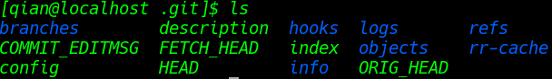

## 工作区与版本库

#### 工作区

前面多次提到工作区的概念，其实工作区就是进行操作的目录

#### 版本库

还记得前面说过的不要手动修改的`.git`目录吧，这就是版本库，里面的内容如下：

其中的`index`就是暂存区，当把文件添加并提交到版本库时，过程是这样的：

第一步是用`git add`把文件添加进去，实际上就是把文件修改添加到暂存区(index)

第二步是用`git commit`提交更改，实际上就是把暂存区的所有内容提交到当前分支(master)

因为创建Git版本库时，Git会自动创建唯一一个master分支，如上图，所以现在的`git commit`都是往`master`分支上提交更改。
